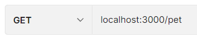
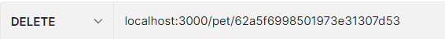

**PET APP**

This is an assignment on PET APIs which include the following operations:

- A POST route “/api/pet” to add pets from an excel file
- A GET route “/api/pet” to get all the pets in the database
- A GET route “/api/pet/” to get a specific pet (petId will be a dynamic value eg. /api/pet/abc123)
- A PATCH route “/api/pet/” to update the details of a specific pet
- A DELETE route “/api/pet/” to delete a specific pet

The libraries and modules used for the app are

1. Node modules
1. Express
1. Mongoose
1. Xlsx 

For Running the application:
Clone the repo and run the application with either mongoose or mongo compass 

npm run dev

Implementation: The different api’s are implemented according to the features mentioned above.

The POST api  takes a PetsInfo.xlsx file after which the individual sheet is parsed using the filepath and the data from the sheets is stored in an array which is then pushed using the insertMany function in the defined mongoose model “Petinfo”, and these json’s are added in the mongodb database named “Pets”.

To perform the post operation: Call the API “/api/pet” with http POST request, the PetsInfo.xlsx file is present in the “assignment” folder, from which the entries can be edited to be added to the database, the response is the data added from the excel file to the database.

The GET api uses the find method to get the list of data entries from the pet-api table in the Pets Database.

To perform the get operation Call with http GET request, it will return the list of pets.

The GET api by Id uses the findById method to get the list of data entries from the pet-api table.

To perform this get operation Call with http GET request with an id, it will return the details of pets with provided id.

The PATCH api uses the findByIdAndUpdate method to update where the entry to be updated with the key value is passed in the request body.

To perform the patch operation Call with http PATCH request with an id, it will return the updated details of pets with provided id.

The DELETE Api takes the Id as the request body and uses the findByIdAndDelete method to delete the entry from the table.

To perform the delete operation Call with http DELETE request with an id, it will return the updated details of pets with provided id.

Sample Request and Response:

